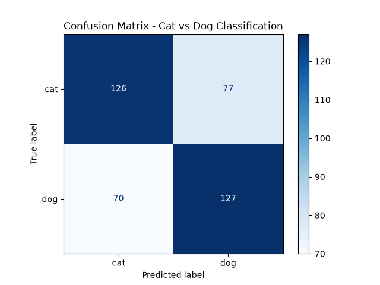

# Task 03 - SVM Image Classifier (Cats vs Dogs)

## Objective
Implement a Support Vector Machine (SVM) to classify images of cats and dogs, using the Kaggle "Dogs vs Cats" dataset.

## Dataset
- Source: Kaggle "Dogs vs Cats" dataset (25,000 labeled images)
- Used a subset of 2,000 images (1,000 cats + 1,000 dogs) to keep training time manageable
- Images resized to 64x64 pixels and flattened into numeric arrays for the model
- Dataset link: [Dogs vs Cats - Kaggle](https://www.kaggle.com/c/dogs-vs-cats/data)

## Approach
1. Loaded and resized images using OpenCV
2. Flattened each image into a 1D array of pixel values
3. Scaled the pixel values using `StandardScaler` for better model performance
4. Split data into 80% training / 20% testing
5. Trained an SVM classifier (`sklearn.svm.SVC`) using an RBF kernel

## Results
- **Accuracy: 63.25%**
- Precision/Recall are fairly balanced between cats and dogs (~62-64% each)
- Initial attempt with a linear kernel and unscaled pixels achieved only 54.75% accuracy — scaling the data and switching to an RBF kernel improved performance noticeably

The confusion matrix shows how many cats and dogs were correctly vs incorrectly classified. Misclassifications are roughly balanced between the two classes, consistent with the overall accuracy.

## Notes
- Accuracy is modest because this uses raw pixel values rather than more advanced feature extraction (e.g. deep learning/CNNs), which is expected for a classical SVM approach on image data
- Trained on a subset of the full dataset to keep runtime practical on a personal laptop

## Tech Stack
- Python
- OpenCV (image loading/resizing)
- scikit-learn (SVM, train/test split, scaling, metrics)
- NumPy
- Matplotlib (confusion matrix visualization)

## How to run
1. Install dependencies: `pip install opencv-python scikit-learn numpy matplotlib`
2. Download the dataset from Kaggle: [Dogs vs Cats](https://www.kaggle.com/c/dogs-vs-cats/data) (requires a free Kaggle account)
3. Download `train.zip`, extract it, and place the resulting `train` folder in the same directory as `train_model.py`
   - After extraction, image paths should look like: `train/train/cat.0.jpg`
4. Run: `python train_model.py`
5. This prints accuracy/classification report and saves `confusion_matrix.png`